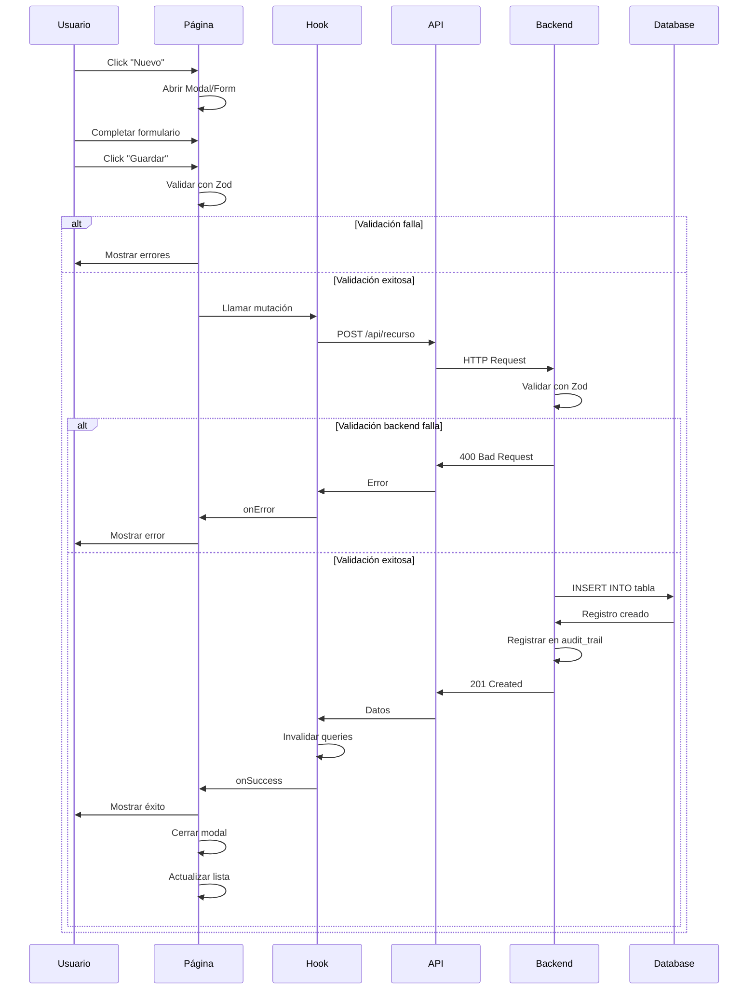
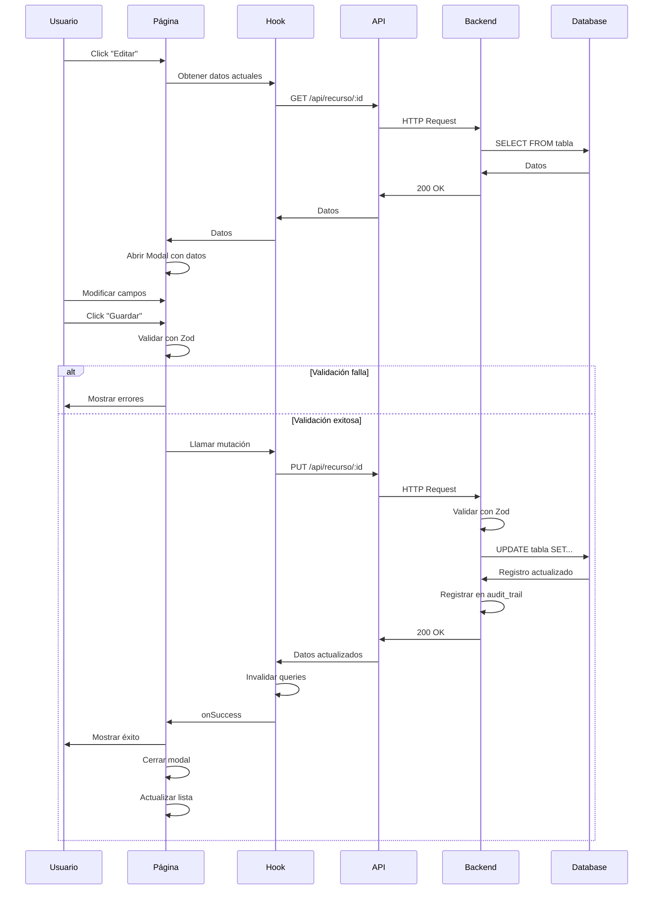
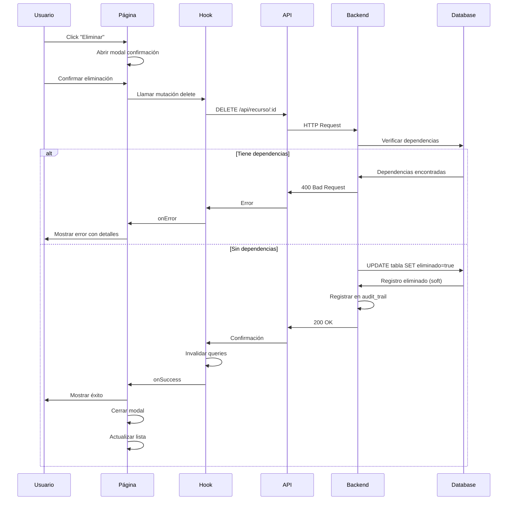

# Documento de Diseño - Sistema Completo de Configuración POS

## Resumen General

Este documento describe el diseño técnico para completar el sistema de configuración del POS multitenant. El sistema permitirá a los administradores gestionar todos los aspectos de configuración incluyendo empresas, sucursales, almacenes, cajas, impresoras, métodos de pago, tipos de comprobantes, serialización, usuarios, roles y permisos.

### Objetivos del Diseño

1. Proporcionar una interfaz unificada y consistente para todas las configuraciones
2. Asegurar la integridad de datos y validación en todos los niveles
3. Mantener la arquitectura multitenant con aislamiento por empresa
4. Implementar auditoría completa de cambios de configuración
5. Optimizar el rendimiento con caching y lazy loading
6. Garantizar accesibilidad y diseño responsivo

### Principios de Diseño

- **Consistencia**: Todos los módulos de configuración seguirán el mismo patrón de UI/UX
- **Modularidad**: Cada sección de configuración será un módulo independiente y reutilizable
- **Validación en capas**: Validación en frontend (Zod), backend (Zod) y base de datos (constraints)
- **Optimistic UI**: Actualizaciones optimistas con rollback en caso de error
- **Progressive Enhancement**: Funcionalidad básica primero, características avanzadas después

## Arquitectura

### Arquitectura General del Sistema

```
┌─────────────────────────────────────────────────────────────┐
│                      Frontend (React)                        │
│  ┌────────────┐  ┌────────────┐  ┌────────────┐            │
│  │   Pages    │  │  Features  │  │   Shared   │            │
│  │            │  │            │  │            │            │
│  │ Settings   │→ │ API Layer  │→ │ Components │            │
│  │ Pages      │  │ Hooks      │  │ Utils      │            │
│  └────────────┘  └────────────┘  └────────────┘            │
│         ↓              ↓                                     │
│  ┌──────────────────────────────────────────┐              │
│  │        React Query (State Management)     │              │
│  └──────────────────────────────────────────┘              │
└─────────────────────────────────────────────────────────────┘
                         ↓ HTTP/REST
┌─────────────────────────────────────────────────────────────┐
│                    Backend API (Express)                     │
│  ┌────────────┐  ┌────────────┐  ┌────────────┐            │
│  │ Controllers│→ │  Services  │→ │Repositories│            │
│  │            │  │            │  │            │            │
│  │ Validation │  │  Business  │  │   Data     │            │
│  │ (Zod DTOs) │  │   Logic    │  │   Access   │            │
│  └────────────┘  └────────────┘  └────────────┘            │
│         ↓              ↓              ↓                      │
│  ┌──────────────────────────────────────────┐              │
│  │     Middleware (Auth, Audit, Error)      │              │
│  └──────────────────────────────────────────┘              │
└─────────────────────────────────────────────────────────────┘
                         ↓ SQL
┌─────────────────────────────────────────────────────────────┐
│                    Database (MySQL)                          │
│  ┌────────────┐  ┌────────────┐  ┌────────────┐            │
│  │   Tables   │  │   Views    │  │  Triggers  │            │
│  │            │  │            │  │            │            │
│  │ Multitenant│  │  Reports   │  │   Audit    │            │
│  │ Soft Delete│  │  Analytics │  │   Alerts   │            │
│  └────────────┘  └────────────┘  └────────────┘            │
└─────────────────────────────────────────────────────────────┘
```


### Arquitectura Frontend

#### Estructura de Carpetas

```
frontend/src/
├── pages/
│   ├── settings/
│   │   ├── CompanySettingsPage.jsx
│   │   ├── BranchesPage.jsx
│   │   ├── WarehousesPage.jsx
│   │   ├── CashRegistersPage.jsx
│   │   ├── PrintersPage.jsx
│   │   ├── PaymentMethodsPage.jsx
│   │   ├── DocumentTypesPage.jsx
│   │   ├── SerializationPage.jsx
│   │   ├── UsersPage.jsx
│   │   ├── RolesPage.jsx
│   │   └── CategoriesPage.jsx
│   └── SettingsPage.jsx (Dashboard de configuración)
├── features/
│   └── settings/
│       ├── api/
│       │   ├── company.api.js
│       │   ├── branches.api.js
│       │   ├── warehouses.api.js
│       │   ├── cashRegisters.api.js
│       │   ├── printers.api.js
│       │   ├── paymentMethods.api.js
│       │   ├── documentTypes.api.js
│       │   ├── serialization.api.js
│       │   ├── users.api.js
│       │   ├── roles.api.js
│       │   └── categories.api.js
│       ├── hooks/
│       │   ├── useCompany.js
│       │   ├── useBranches.js
│       │   ├── useWarehouses.js
│       │   ├── useCashRegisters.js
│       │   ├── usePrinters.js
│       │   ├── usePaymentMethods.js
│       │   ├── useDocumentTypes.js
│       │   ├── useSerialization.js
│       │   ├── useUsers.js
│       │   ├── useRoles.js
│       │   └── useCategories.js
│       ├── components/
│       │   ├── ConfigurationCard.jsx
│       │   ├── ConfigurationTable.jsx
│       │   ├── ConfigurationForm.jsx
│       │   ├── PermissionsMatrix.jsx
│       │   ├── BranchSelector.jsx
│       │   ├── RoleSelector.jsx
│       │   └── ValidationSummary.jsx
│       └── schemas/
│           ├── company.schema.js
│           ├── branch.schema.js
│           ├── warehouse.schema.js
│           └── ... (otros esquemas Zod)
└── shared/
    ├── components/
    │   ├── ui/ (componentes existentes)
    │   └── forms/
    │       ├── FormField.jsx
    │       ├── FormSelect.jsx
    │       ├── FormCheckbox.jsx
    │       ├── FormTextarea.jsx
    │       └── ImageUpload.jsx
    └── utils/
        ├── validation.js
        ├── formatting.js
        └── constants.js
```


### Arquitectura Backend

#### Estructura de API Endpoints

Todos los endpoints siguen el patrón REST estándar:

```
/api/
├── empresas/
│   ├── GET    /                    - Listar todas las empresas
│   ├── GET    /:id                 - Obtener empresa por ID
│   ├── POST   /                    - Crear empresa
│   ├── PUT    /:id                 - Actualizar empresa
│   └── DELETE /:id                 - Eliminar empresa (soft delete)
├── sucursales/
│   ├── GET    /por-empresa/:idEmpresa
│   ├── GET    /:id
│   ├── POST   /
│   ├── PUT    /:id
│   └── DELETE /:id
├── almacenes/
│   ├── GET    /por-sucursal/:idSucursal
│   ├── GET    /:id
│   ├── POST   /
│   ├── PUT    /:id
│   └── DELETE /:id
├── cajas/
│   ├── GET    /por-sucursal/:idSucursal
│   ├── GET    /:id
│   ├── POST   /
│   ├── PUT    /:id
│   └── DELETE /:id
├── impresoras/
│   ├── GET    /por-empresa/:idEmpresa
│   ├── GET    /:id
│   ├── POST   /
│   ├── PUT    /:id
│   ├── DELETE /:id
│   └── POST   /:id/test           - Probar impresora
├── metodos-pago/
│   ├── GET    /por-empresa/:idEmpresa
│   ├── GET    /:id
│   ├── POST   /
│   ├── PUT    /:id
│   └── DELETE /:id
├── tipos-comprobante/
│   ├── GET    /por-empresa/:idEmpresa
│   ├── GET    /:id
│   ├── POST   /
│   ├── PUT    /:id
│   └── DELETE /:id
├── serializacion-comprobantes/
│   ├── GET    /por-sucursal/:idSucursal
│   ├── GET    /por-tipo/:idTipoComprobante
│   ├── GET    /:id
│   ├── POST   /
│   ├── PUT    /:id
│   └── DELETE /:id
├── usuarios/
│   ├── GET    /por-empresa/:idEmpresa
│   ├── GET    /:id
│   ├── POST   /                    - Crear usuario (admin)
│   ├── PUT    /:id
│   ├── DELETE /:id
│   └── POST   /:id/reset-password  - Resetear contraseña
├── roles/
│   ├── GET    /por-empresa/:idEmpresa
│   ├── GET    /:id
│   ├── POST   /
│   ├── PUT    /:id
│   └── DELETE /:id
├── permisos/
│   ├── GET    /por-rol/:idRol
│   ├── POST   /asignar             - Asignar permisos a rol
│   ├── PUT    /:id
│   └── DELETE /:id
├── categorias/
│   ├── GET    /por-empresa/:idEmpresa
│   ├── GET    /:id
│   ├── POST   /
│   ├── PUT    /:id
│   └── DELETE /:id
└── configuracion/
    ├── GET    /validar             - Validar configuración completa
    ├── POST   /exportar            - Exportar configuración
    └── POST   /importar            - Importar configuración
```


## Componentes y Interfaces

### Componentes Frontend Principales

#### 1. ConfigurationLayout

Componente de layout compartido para todas las páginas de configuración.

```jsx
<ConfigurationLayout
  title="Título de la Sección"
  description="Descripción de la sección"
  actions={<Button>Nueva Acción</Button>}
>
  {children}
</ConfigurationLayout>
```

**Props:**
- `title`: string - Título de la página
- `description`: string - Descripción breve
- `actions`: ReactNode - Botones de acción (crear, exportar, etc.)
- `children`: ReactNode - Contenido principal

#### 2. ConfigurationTable

Tabla reutilizable para mostrar listados de configuración.

```jsx
<ConfigurationTable
  columns={columns}
  data={data}
  isLoading={isLoading}
  onEdit={handleEdit}
  onDelete={handleDelete}
  emptyMessage="No hay registros"
/>
```

**Props:**
- `columns`: Array<Column> - Definición de columnas
- `data`: Array<Object> - Datos a mostrar
- `isLoading`: boolean - Estado de carga
- `onEdit`: (item) => void - Callback para editar
- `onDelete`: (item) => void - Callback para eliminar
- `emptyMessage`: string - Mensaje cuando no hay datos

#### 3. ConfigurationForm

Formulario genérico para crear/editar configuraciones.

```jsx
<ConfigurationForm
  fields={fields}
  values={values}
  onChange={handleChange}
  onSubmit={handleSubmit}
  isSubmitting={isSubmitting}
  errors={errors}
/>
```

**Props:**
- `fields`: Array<FieldConfig> - Configuración de campos
- `values`: Object - Valores actuales del formulario
- `onChange`: (field, value) => void - Callback de cambio
- `onSubmit`: () => void - Callback de envío
- `isSubmitting`: boolean - Estado de envío
- `errors`: Object - Errores de validación

#### 4. PermissionsMatrix

Matriz de permisos para roles.

```jsx
<PermissionsMatrix
  modules={modules}
  permissions={permissions}
  onChange={handlePermissionChange}
  readOnly={false}
/>
```

**Props:**
- `modules`: Array<Module> - Lista de módulos del sistema
- `permissions`: Object - Permisos actuales {moduleId: {ver, crear, editar, eliminar}}
- `onChange`: (moduleId, permission, value) => void
- `readOnly`: boolean - Solo lectura

#### 5. ValidationSummary

Resumen de validación de configuración.

```jsx
<ValidationSummary
  validations={validations}
  onRevalidate={handleRevalidate}
/>
```

**Props:**
- `validations`: Array<Validation> - Resultados de validación
- `onRevalidate`: () => void - Callback para revalidar


### Modelos de Datos

#### Empresa (Company)

```typescript
interface Empresa {
  id: number;
  nombre: string;
  id_fiscal: string;
  direccion_fiscal: string;
  simbolo_moneda: string;
  logo: string | null;
  currency: string;
  impuesto: string;
  valor_impuesto: number;
  nombre_moneda: string;
  correo: string;
  pie_pagina_ticket: string | null;
  activo: boolean;
  fecha_creacion: string;
  fecha_actualizacion: string;
}
```

#### Sucursal (Branch)

```typescript
interface Sucursal {
  id: number;
  id_empresa: number;
  codigo: string;
  nombre: string;
  direccion: string;
  direccion_fiscal: string | null;
  telefono: string | null;
  email: string | null;
  activo: boolean;
  fecha_creacion: string;
  fecha_actualizacion: string;
}
```

#### Almacén (Warehouse)

```typescript
interface Almacen {
  id: number;
  id_empresa: number;
  id_sucursal: number;
  codigo: string;
  nombre: string;
  descripcion: string | null;
  default: boolean;
  activo: boolean;
  fecha_creacion: string;
  fecha_actualizacion: string;
}
```

#### Caja (Cash Register)

```typescript
interface Caja {
  id: number;
  id_empresa: number;
  id_sucursal: number;
  codigo: string;
  nombre: string;
  descripcion: string | null;
  monto_inicial: number;
  print: boolean;
  activo: boolean;
  fecha_creacion: string;
  fecha_actualizacion: string;
}
```

#### Impresora (Printer)

```typescript
interface Impresora {
  id: number;
  id_empresa: number;
  id_sucursal: number;
  id_caja: number | null;
  name: string;
  tipo: 'termica' | 'matricial' | 'laser';
  puerto: string | null;
  pc_name: string | null;
  ip_local: string | null;
  state: boolean;
  configuracion: object | null;
  activo: boolean;
  fecha_creacion: string;
  fecha_actualizacion: string;
}
```

#### Método de Pago (Payment Method)

```typescript
interface MetodoPago {
  id: number;
  id_empresa: number;
  codigo: string;
  nombre: string;
  descripcion: string | null;
  imagen: string | null;
  requiere_referencia: boolean;
  activo: boolean;
  fecha_creacion: string;
  fecha_actualizacion: string;
}
```

#### Tipo de Comprobante (Document Type)

```typescript
interface TipoComprobante {
  id: number;
  id_empresa: number;
  codigo: string;
  nombre: string;
  descripcion: string | null;
  destino: 'VENTA' | 'COMPRA' | 'INTERNO';
  activo: boolean;
  fecha_creacion: string;
  fecha_actualizacion: string;
}
```

#### Serialización (Serialization)

```typescript
interface SerializacionComprobante {
  id: number;
  id_empresa: number;
  id_sucursal: number;
  id_tipo_comprobante: number;
  serie: string;
  numero_inicial: number;
  numero_actual: number;
  numero_final: number | null;
  cantidad_numeros: number;
  por_default: boolean;
  activo: boolean;
  fecha_creacion: string;
  fecha_actualizacion: string;
}
```

#### Usuario (User)

```typescript
interface Usuario {
  id: number;
  id_empresa: number;
  id_rol: number;
  username: string;
  nombres: string;
  apellidos: string;
  email: string | null;
  telefono: string | null;
  id_tipodocumento: number | null;
  nro_doc: string | null;
  tema: 'light' | 'dark';
  estado: 'ACTIVO' | 'INACTIVO';
  activo: boolean;
  ultimo_acceso: string | null;
  fecha_creacion: string;
  fecha_actualizacion: string;
}
```

#### Rol (Role)

```typescript
interface Rol {
  id: number;
  id_empresa: number;
  nombre: string;
  descripcion: string | null;
  activo: boolean;
  fecha_creacion: string;
  fecha_actualizacion: string;
}
```

#### Permiso (Permission)

```typescript
interface Permiso {
  id: number;
  id_empresa: number;
  id_rol: number;
  id_modulo: number;
  puede_ver: boolean;
  puede_crear: boolean;
  puede_editar: boolean;
  puede_eliminar: boolean;
  fecha_creacion: string;
  fecha_actualizacion: string;
}
```

#### Categoría (Category)

```typescript
interface Categoria {
  id: number;
  id_empresa: number;
  codigo: string;
  nombre: string;
  descripcion: string | null;
  color: string;
  icono: string;
  activo: boolean;
  fecha_creacion: string;
  fecha_actualizacion: string;
}
```


## Flujos de Datos

### Flujo de Creación de Configuración



### Flujo de Actualización de Configuración



### Flujo de Eliminación de Configuración




## Manejo de Errores

### Estrategia de Manejo de Errores

#### Frontend

1. **Validación de Formularios (Zod)**
   - Validación en tiempo real mientras el usuario escribe
   - Mensajes de error específicos por campo
   - Prevención de envío si hay errores

2. **Errores de API**
   - Captura de errores en hooks de React Query
   - Transformación de errores del backend a mensajes amigables
   - Uso del sistema de toasts para notificaciones

3. **Errores de Red**
   - Detección de pérdida de conexión
   - Reintentos automáticos con backoff exponencial
   - Notificación al usuario del estado de conexión

#### Backend

1. **Validación de Entrada (Zod)**
   - Validación de DTOs en controladores
   - Mensajes de error estructurados
   - Códigos de error específicos

2. **Errores de Negocio**
   - Validaciones de reglas de negocio en servicios
   - Errores personalizados con contexto
   - Logging de errores críticos

3. **Errores de Base de Datos**
   - Manejo de violaciones de constraints
   - Traducción de errores SQL a mensajes amigables
   - Rollback de transacciones en caso de error

### Códigos de Error Estándar

```javascript
const ERROR_CODES = {
  // Validación
  VALIDATION_ERROR: 'VALIDATION_ERROR',
  REQUIRED_FIELD: 'REQUIRED_FIELD',
  INVALID_FORMAT: 'INVALID_FORMAT',
  
  // Negocio
  DUPLICATE_CODE: 'DUPLICATE_CODE',
  HAS_DEPENDENCIES: 'HAS_DEPENDENCIES',
  INVALID_STATE: 'INVALID_STATE',
  LIMIT_EXCEEDED: 'LIMIT_EXCEEDED',
  
  // Autorización
  UNAUTHORIZED: 'UNAUTHORIZED',
  FORBIDDEN: 'FORBIDDEN',
  INVALID_TOKEN: 'INVALID_TOKEN',
  
  // Recursos
  NOT_FOUND: 'NOT_FOUND',
  ALREADY_EXISTS: 'ALREADY_EXISTS',
  
  // Sistema
  INTERNAL_ERROR: 'INTERNAL_ERROR',
  DATABASE_ERROR: 'DATABASE_ERROR',
  NETWORK_ERROR: 'NETWORK_ERROR',
};
```

### Formato de Respuesta de Error

```javascript
{
  "exito": false,
  "mensaje": "Mensaje de error amigable",
  "codigo": "ERROR_CODE",
  "detalles": {
    "campo": "nombre_campo",
    "valor": "valor_invalido",
    "razon": "Razón específica del error"
  },
  "timestamp": "2024-01-15T10:30:00Z",
  "path": "/api/sucursales",
  "metodo": "POST"
}
```


## Estrategia de Testing

### Testing Frontend

#### 1. Unit Tests (Vitest + React Testing Library)

**Componentes a testear:**
- Componentes de UI reutilizables
- Hooks personalizados
- Funciones de utilidad
- Esquemas de validación Zod

**Ejemplo:**
```javascript
describe('ConfigurationTable', () => {
  it('should render table with data', () => {
    const data = [{ id: 1, nombre: 'Test' }];
    render(<ConfigurationTable data={data} columns={columns} />);
    expect(screen.getByText('Test')).toBeInTheDocument();
  });

  it('should call onEdit when edit button is clicked', () => {
    const onEdit = vi.fn();
    render(<ConfigurationTable data={data} onEdit={onEdit} />);
    fireEvent.click(screen.getByText('Editar'));
    expect(onEdit).toHaveBeenCalledWith(data[0]);
  });
});
```

#### 2. Integration Tests

**Flujos a testear:**
- Crear nueva configuración
- Editar configuración existente
- Eliminar configuración
- Validación de formularios
- Manejo de errores

#### 3. E2E Tests (Opcional - Playwright/Cypress)

**Escenarios críticos:**
- Flujo completo de configuración inicial
- Gestión de permisos de roles
- Configuración de serialización de documentos

### Testing Backend

#### 1. Unit Tests (Jest/Vitest)

**Servicios a testear:**
- Lógica de negocio en servicios
- Validaciones personalizadas
- Transformaciones de datos
- Funciones de utilidad

**Ejemplo:**
```javascript
describe('ServicioSucursales', () => {
  it('should create branch with valid data', async () => {
    const data = {
      idEmpresa: 1,
      codigo: 'SUC001',
      nombre: 'Sucursal Principal'
    };
    const result = await crearSucursal(data);
    expect(result).toHaveProperty('id');
    expect(result.codigo).toBe('SUC001');
  });

  it('should throw error for duplicate code', async () => {
    await expect(crearSucursal(duplicateData))
      .rejects.toThrow('Código ya existe');
  });
});
```

#### 2. Integration Tests

**Endpoints a testear:**
- CRUD completo de cada recurso
- Validaciones de entrada
- Manejo de errores
- Autorización y permisos

**Ejemplo:**
```javascript
describe('POST /api/sucursales', () => {
  it('should create branch successfully', async () => {
    const response = await request(app)
      .post('/api/sucursales')
      .set('Authorization', `Bearer ${token}`)
      .send(validData);
    
    expect(response.status).toBe(201);
    expect(response.body.datos).toHaveProperty('id');
  });

  it('should return 400 for invalid data', async () => {
    const response = await request(app)
      .post('/api/sucursales')
      .set('Authorization', `Bearer ${token}`)
      .send(invalidData);
    
    expect(response.status).toBe(400);
    expect(response.body.codigo).toBe('VALIDATION_ERROR');
  });
});
```

#### 3. Database Tests

**Validaciones a testear:**
- Constraints de unicidad
- Foreign keys
- Triggers
- Soft delete


## Seguridad

### Autenticación y Autorización

#### 1. Autenticación

- **JWT Tokens**: Tokens de acceso y refresh
- **Sesiones**: Almacenadas en tabla `sesiones`
- **Expiración**: Tokens con tiempo de vida limitado
- **Renovación**: Refresh token para renovar acceso

#### 2. Autorización

**Niveles de acceso:**
- **Super Admin**: Acceso completo a todas las empresas
- **Admin Empresa**: Acceso completo a su empresa
- **Gerente Sucursal**: Acceso a su sucursal
- **Usuario**: Acceso según permisos de rol

**Middleware de autorización:**
```javascript
// Verificar acceso a empresa
autorizarEmpresa(req, res, next)

// Verificar acceso a sucursal
autorizarSucursal(req, res, next)

// Verificar permisos de rol
autorizarRoles(['admin', 'gerente'])(req, res, next)

// Verificar permiso específico en módulo
autorizarPermiso('sucursales', 'crear')(req, res, next)
```

### Validación de Datos

#### Frontend (Zod)

```javascript
const sucursalSchema = z.object({
  idEmpresa: z.number().int().positive(),
  codigo: z.string().min(1).max(10).regex(/^[A-Z0-9]+$/),
  nombre: z.string().min(3).max(100),
  direccion: z.string().min(5).max(500),
  telefono: z.string().regex(/^\+?[0-9]{7,15}$/).optional(),
  email: z.string().email().optional(),
});
```

#### Backend (Zod)

```javascript
const esquemaCrearSucursal = z.object({
  idEmpresa: z.number().int().positive(),
  codigo: z.string().min(1).max(10),
  nombre: z.string().min(3).max(100),
  direccion: z.string().min(5).max(500),
  direccionFiscal: z.string().max(500).optional(),
  telefono: z.string().max(20).optional(),
  email: z.string().email().max(100).optional(),
});
```

### Protección contra Ataques

#### 1. SQL Injection
- Uso de prepared statements (Knex.js)
- Validación de entrada con Zod
- Sanitización de datos

#### 2. XSS (Cross-Site Scripting)
- Escape de HTML en frontend
- Content Security Policy headers
- Validación de entrada

#### 3. CSRF (Cross-Site Request Forgery)
- Tokens CSRF en formularios
- Verificación de origen
- SameSite cookies

#### 4. Rate Limiting
- Límite de requests por IP
- Límite de requests por usuario
- Protección contra fuerza bruta

### Auditoría

Todos los cambios de configuración se registran en `audit_trail`:

```javascript
{
  id_empresa: 1,
  id_usuario: 5,
  tabla: 'sucursales',
  id_registro: 10,
  accion: 'UPDATE',
  datos_anteriores: { nombre: 'Sucursal A' },
  datos_nuevos: { nombre: 'Sucursal Principal' },
  ip_address: '192.168.1.100',
  user_agent: 'Mozilla/5.0...',
  fecha_accion: '2024-01-15T10:30:00Z'
}
```


## Optimización de Rendimiento

### Frontend

#### 1. Code Splitting
- Lazy loading de páginas de configuración
- Carga bajo demanda de componentes pesados
- Chunks separados por módulo

```javascript
const BranchesPage = lazy(() => import('./pages/settings/BranchesPage'));
const WarehousesPage = lazy(() => import('./pages/settings/WarehousesPage'));
```

#### 2. Caching con React Query

```javascript
const queryClient = new QueryClient({
  defaultOptions: {
    queries: {
      staleTime: 5 * 60 * 1000, // 5 minutos
      cacheTime: 10 * 60 * 1000, // 10 minutos
      refetchOnWindowFocus: false,
      retry: 1,
    },
  },
});
```

#### 3. Optimistic Updates

```javascript
const updateMutation = useMutation({
  mutationFn: updateBranch,
  onMutate: async (newData) => {
    await queryClient.cancelQueries(['branches']);
    const previous = queryClient.getQueryData(['branches']);
    queryClient.setQueryData(['branches'], (old) => 
      old.map(item => item.id === newData.id ? newData : item)
    );
    return { previous };
  },
  onError: (err, newData, context) => {
    queryClient.setQueryData(['branches'], context.previous);
  },
});
```

#### 4. Virtualización de Listas
- Uso de react-window para listas largas
- Renderizado solo de elementos visibles
- Scroll infinito para paginación

#### 5. Debouncing de Búsquedas

```javascript
const debouncedSearch = useMemo(
  () => debounce((value) => setSearchTerm(value), 300),
  []
);
```

### Backend

#### 1. Índices de Base de Datos
- Índices en campos de búsqueda frecuente
- Índices compuestos para queries complejas
- Índices en foreign keys

```sql
CREATE INDEX idx_sucursales_empresa_activo 
ON sucursales(id_empresa, activo);

CREATE INDEX idx_usuarios_empresa_rol 
ON usuarios(id_empresa, id_rol, activo);
```

#### 2. Paginación

```javascript
async function obtenerSucursales(idEmpresa, { page = 1, limit = 20 }) {
  const offset = (page - 1) * limit;
  const [data, total] = await Promise.all([
    db('sucursales')
      .where({ id_empresa: idEmpresa, eliminado: false })
      .limit(limit)
      .offset(offset),
    db('sucursales')
      .where({ id_empresa: idEmpresa, eliminado: false })
      .count('* as total')
  ]);
  
  return {
    data,
    pagination: {
      page,
      limit,
      total: total[0].total,
      pages: Math.ceil(total[0].total / limit)
    }
  };
}
```

#### 3. Caching de Consultas Frecuentes
- Cache de catálogos (métodos de pago, tipos de documento)
- Cache de permisos de usuario
- Invalidación selectiva de cache

#### 4. Optimización de Queries
- Uso de JOINs eficientes
- Selección solo de campos necesarios
- Evitar N+1 queries

```javascript
// Malo - N+1 queries
const sucursales = await db('sucursales').where({ id_empresa });
for (const sucursal of sucursales) {
  sucursal.almacenes = await db('almacen').where({ id_sucursal: sucursal.id });
}

// Bueno - 1 query con JOIN
const sucursales = await db('sucursales')
  .leftJoin('almacen', 'sucursales.id', 'almacen.id_sucursal')
  .where({ 'sucursales.id_empresa': idEmpresa })
  .select('sucursales.*', db.raw('JSON_ARRAYAGG(almacen.*) as almacenes'))
  .groupBy('sucursales.id');
```

#### 5. Connection Pooling
- Pool de conexiones a base de datos
- Configuración óptima de tamaño de pool
- Timeout y retry logic

```javascript
const pool = {
  min: 2,
  max: 10,
  acquireTimeoutMillis: 30000,
  idleTimeoutMillis: 30000,
};
```


## Diseño de UI/UX

### Principios de Diseño

1. **Consistencia**: Todos los módulos siguen el mismo patrón visual
2. **Claridad**: Información clara y organizada jerárquicamente
3. **Feedback**: Respuesta inmediata a acciones del usuario
4. **Prevención de errores**: Validación en tiempo real
5. **Accesibilidad**: Cumplimiento de WCAG 2.1 AA

### Layout de Páginas de Configuración

```
┌─────────────────────────────────────────────────────────────┐
│ Header                                                       │
│ ┌─────────────────────────────────────────────────────────┐ │
│ │ Título de Sección                    [Botón Acción]     │ │
│ │ Descripción breve de la sección                         │ │
│ └─────────────────────────────────────────────────────────┘ │
├─────────────────────────────────────────────────────────────┤
│ Filtros y Búsqueda                                          │
│ ┌─────────────────────────────────────────────────────────┐ │
│ │ [🔍 Buscar...] [Filtro 1▼] [Filtro 2▼] [Limpiar]      │ │
│ └─────────────────────────────────────────────────────────┘ │
├─────────────────────────────────────────────────────────────┤
│ Contenido Principal                                         │
│ ┌─────────────────────────────────────────────────────────┐ │
│ │ Tabla / Cards / Grid                                    │ │
│ │                                                          │ │
│ │ [Datos...]                                              │ │
│ │                                                          │ │
│ └─────────────────────────────────────────────────────────┘ │
├─────────────────────────────────────────────────────────────┤
│ Paginación                                                  │
│ ┌─────────────────────────────────────────────────────────┐ │
│ │ Mostrando 1-20 de 150    [◀] 1 2 3 ... 8 [▶]          │ │
│ └─────────────────────────────────────────────────────────┘ │
└─────────────────────────────────────────────────────────────┘
```

### Componentes de Formulario

#### Modal de Crear/Editar

```
┌─────────────────────────────────────────────┐
│ Título del Modal                        [✕] │
├─────────────────────────────────────────────┤
│                                             │
│ Campo 1 *                                   │
│ [___________________________________]       │
│                                             │
│ Campo 2                                     │
│ [___________________________________]       │
│                                             │
│ Campo 3 *                                   │
│ [___________________________________]       │
│ ⚠ Error: Este campo es requerido           │
│                                             │
├─────────────────────────────────────────────┤
│                    [Cancelar] [Guardar]     │
└─────────────────────────────────────────────┘
```

#### Estados de Carga

1. **Skeleton Loaders**: Para carga inicial de datos
2. **Spinners**: Para acciones que toman tiempo
3. **Progress Bars**: Para operaciones largas (importación)
4. **Disabled States**: Botones deshabilitados durante procesamiento

### Paleta de Colores

```css
:root {
  /* Colores principales */
  --primary: #3b82f6;
  --primary-hover: #2563eb;
  --secondary: #64748b;
  --secondary-hover: #475569;
  
  /* Estados */
  --success: #10b981;
  --warning: #f59e0b;
  --error: #ef4444;
  --info: #3b82f6;
  
  /* Neutrales */
  --base-100: #ffffff;
  --base-200: #f8fafc;
  --base-300: #e2e8f0;
  --base-content: #1e293b;
  
  /* Tema oscuro */
  --dark-base-100: #1e293b;
  --dark-base-200: #0f172a;
  --dark-base-300: #334155;
  --dark-base-content: #f1f5f9;
}
```

### Iconografía

Uso de iconos consistentes para acciones comunes:
- ➕ Crear/Agregar
- ✏️ Editar
- 🗑️ Eliminar
- 👁️ Ver/Detalles
- 🔍 Buscar
- ⚙️ Configurar
- 📊 Reportes
- 💾 Guardar
- ❌ Cancelar
- ✓ Confirmar

### Responsive Design

#### Breakpoints

```css
/* Mobile */
@media (max-width: 640px) { }

/* Tablet */
@media (min-width: 641px) and (max-width: 1024px) { }

/* Desktop */
@media (min-width: 1025px) { }
```

#### Adaptaciones Móviles

1. **Tablas**: Convertir a cards en móvil
2. **Formularios**: Stack vertical de campos
3. **Modales**: Fullscreen en móvil
4. **Navegación**: Menú hamburguesa
5. **Acciones**: Botones flotantes para acciones principales


## Consideraciones Especiales

### Multitenant

#### Aislamiento de Datos

Todas las queries deben incluir filtro por `id_empresa`:

```javascript
// Correcto
const sucursales = await db('sucursales')
  .where({ 
    id_empresa: req.user.id_empresa,
    eliminado: false 
  });

// Incorrecto - expone datos de otras empresas
const sucursales = await db('sucursales')
  .where({ eliminado: false });
```

#### Middleware de Seguridad

```javascript
function seguridadMultiTenant(req, res, next) {
  // Verificar que el usuario pertenece a la empresa
  if (req.body.idEmpresa && req.body.idEmpresa !== req.user.id_empresa) {
    return res.status(403).json({
      mensaje: 'No tiene acceso a esta empresa'
    });
  }
  
  // Agregar id_empresa automáticamente
  req.body.idEmpresa = req.user.id_empresa;
  next();
}
```

### Soft Delete

#### Implementación

```javascript
// Eliminar (soft delete)
async function eliminarSucursal(id, usuario) {
  const sucursal = await obtenerSucursalPorId(id);
  
  // Verificar dependencias
  const tieneDependencias = await verificarDependencias(id);
  if (tieneDependencias) {
    throw new Error('No se puede eliminar: tiene dependencias activas');
  }
  
  // Soft delete
  await db('sucursales')
    .where({ id })
    .update({
      eliminado: true,
      fecha_eliminacion: new Date(),
      fecha_actualizacion: new Date()
    });
  
  // Auditoría
  await registrarAuditoria({
    id_empresa: sucursal.id_empresa,
    id_usuario: usuario.id,
    tabla: 'sucursales',
    id_registro: id,
    accion: 'DELETE',
    datos_anteriores: sucursal,
    datos_nuevos: { eliminado: true }
  });
  
  return sucursal;
}
```

#### Recuperación

```javascript
// Restaurar registro eliminado
async function restaurarSucursal(id, usuario) {
  await db('sucursales')
    .where({ id })
    .update({
      eliminado: false,
      fecha_eliminacion: null,
      fecha_actualizacion: new Date()
    });
  
  await registrarAuditoria({
    id_usuario: usuario.id,
    tabla: 'sucursales',
    id_registro: id,
    accion: 'RESTORE'
  });
}
```

### Validación de Dependencias

#### Verificación antes de Eliminar

```javascript
async function verificarDependenciasSucursal(idSucursal) {
  const [almacenes, cajas, usuarios] = await Promise.all([
    db('almacen').where({ id_sucursal: idSucursal, eliminado: false }).count('* as total'),
    db('caja').where({ id_sucursal: idSucursal, eliminado: false }).count('* as total'),
    db('asignacion_sucursal').where({ id_sucursal: idSucursal, activo: true }).count('* as total')
  ]);
  
  const dependencias = [];
  if (almacenes[0].total > 0) dependencias.push(`${almacenes[0].total} almacenes`);
  if (cajas[0].total > 0) dependencias.push(`${cajas[0].total} cajas`);
  if (usuarios[0].total > 0) dependencias.push(`${usuarios[0].total} usuarios asignados`);
  
  return {
    tieneDependencias: dependencias.length > 0,
    dependencias
  };
}
```

### Configuración por Defecto

#### Valores Predeterminados

```javascript
const DEFAULTS = {
  empresa: {
    currency: 'PEN',
    simbolo_moneda: 'S/',
    nombre_moneda: 'Soles',
    impuesto: 'IGV',
    valor_impuesto: 18.00,
    iso: 'PE',
    pais: 'Perú'
  },
  categoria: {
    color: '#3b82f6',
    icono: 'folder'
  },
  caja: {
    monto_inicial: 0.00,
    print: true
  },
  impresora: {
    tipo: 'termica',
    state: true
  },
  usuario: {
    tema: 'light',
    estado: 'ACTIVO',
    activo: true
  }
};
```

### Importación/Exportación

#### Formato de Exportación

```json
{
  "version": "1.0",
  "fecha_exportacion": "2024-01-15T10:30:00Z",
  "empresa": {
    "nombre": "Mi Empresa",
    "id_fiscal": "20123456789"
  },
  "configuracion": {
    "sucursales": [...],
    "almacenes": [...],
    "cajas": [...],
    "impresoras": [...],
    "metodos_pago": [...],
    "tipos_comprobante": [...],
    "serializacion": [...],
    "categorias": [...],
    "roles": [...],
    "permisos": [...]
  }
}
```

#### Validación de Importación

```javascript
async function validarImportacion(datos) {
  const errores = [];
  
  // Validar estructura
  if (!datos.version || !datos.configuracion) {
    errores.push('Formato de archivo inválido');
  }
  
  // Validar cada sección
  for (const [seccion, items] of Object.entries(datos.configuracion)) {
    for (const item of items) {
      try {
        await validarEsquema(seccion, item);
      } catch (error) {
        errores.push(`${seccion}: ${error.message}`);
      }
    }
  }
  
  return {
    valido: errores.length === 0,
    errores
  };
}
```


## Plan de Migración y Despliegue

### Estrategia de Migración

#### Fase 1: Preparación
1. Backup completo de base de datos
2. Verificación de esquema actual
3. Ejecución de scripts de migración si es necesario
4. Validación de datos existentes

#### Fase 2: Despliegue Backend
1. Desplegar nuevos endpoints de API
2. Ejecutar tests de integración
3. Verificar logs y métricas
4. Rollback plan preparado

#### Fase 3: Despliegue Frontend
1. Build de producción
2. Despliegue incremental (canary/blue-green)
3. Monitoreo de errores
4. Feedback de usuarios beta

#### Fase 4: Validación
1. Pruebas de humo en producción
2. Verificación de funcionalidades críticas
3. Monitoreo de rendimiento
4. Recolección de feedback

### Checklist de Despliegue

#### Backend
- [ ] Todas las migraciones de BD ejecutadas
- [ ] Variables de entorno configuradas
- [ ] Endpoints documentados en Swagger/OpenAPI
- [ ] Tests pasando (unit + integration)
- [ ] Logs configurados correctamente
- [ ] Rate limiting configurado
- [ ] CORS configurado
- [ ] Backup de BD realizado

#### Frontend
- [ ] Build de producción sin errores
- [ ] Variables de entorno configuradas
- [ ] Assets optimizados (imágenes, fonts)
- [ ] Service worker configurado (si aplica)
- [ ] Analytics configurado
- [ ] Error tracking configurado (Sentry)
- [ ] Tests E2E pasando

### Monitoreo Post-Despliegue

#### Métricas Clave
1. **Rendimiento**
   - Tiempo de respuesta de API
   - Tiempo de carga de páginas
   - Core Web Vitals (LCP, FID, CLS)

2. **Errores**
   - Tasa de errores 4xx/5xx
   - Errores de JavaScript
   - Errores de validación

3. **Uso**
   - Usuarios activos
   - Páginas más visitadas
   - Funcionalidades más usadas

4. **Negocio**
   - Configuraciones creadas
   - Tiempo promedio de configuración
   - Tasa de completitud

### Rollback Plan

#### Criterios para Rollback
- Tasa de errores > 5%
- Tiempo de respuesta > 3 segundos
- Funcionalidad crítica no disponible
- Pérdida de datos detectada

#### Procedimiento de Rollback
1. Notificar al equipo
2. Revertir despliegue frontend
3. Revertir despliegue backend
4. Restaurar BD desde backup (si necesario)
5. Verificar funcionalidad
6. Comunicar a usuarios
7. Análisis post-mortem

## Documentación

### Documentación Técnica

#### 1. API Documentation (OpenAPI/Swagger)
- Endpoints documentados
- Esquemas de request/response
- Ejemplos de uso
- Códigos de error

#### 2. Guía de Desarrollo
- Setup del entorno
- Estructura del proyecto
- Convenciones de código
- Guía de contribución

#### 3. Arquitectura
- Diagramas de arquitectura
- Flujos de datos
- Decisiones de diseño
- Patrones utilizados

### Documentación de Usuario

#### 1. Manual de Usuario
- Guía paso a paso
- Capturas de pantalla
- Casos de uso comunes
- Preguntas frecuentes

#### 2. Videos Tutoriales
- Configuración inicial
- Gestión de sucursales
- Configuración de permisos
- Resolución de problemas

#### 3. Base de Conocimiento
- Artículos de ayuda
- Troubleshooting
- Best practices
- Actualizaciones

## Conclusión

Este diseño proporciona una base sólida para completar el sistema de configuración del POS. Los principios clave son:

1. **Consistencia**: Todos los módulos siguen el mismo patrón
2. **Seguridad**: Multitenant con auditoría completa
3. **Rendimiento**: Optimizaciones en todos los niveles
4. **Mantenibilidad**: Código modular y bien documentado
5. **Escalabilidad**: Arquitectura preparada para crecer

El siguiente paso es crear el plan de implementación detallado con tareas específicas para cada módulo.
