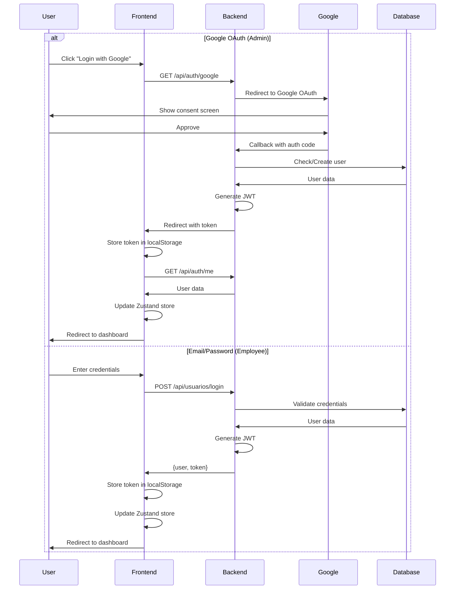
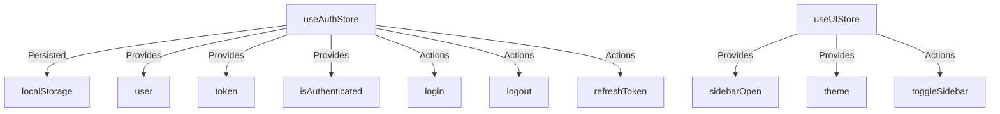

# Design Document

## Overview

Este documento describe el diseño técnico para mejorar el frontend del sistema POS y optimizar la integración de autenticación. El sistema implementa un modelo multi-tenant donde los administradores se autentican con Google OAuth y crean usuarios empleados que se autentican con credenciales (username/password). El rediseño se enfoca en crear una interfaz moderna, profesional y funcional que mejore la experiencia del usuario mientras mantiene la seguridad y escalabilidad del sistema.

### Current State Analysis

**Fortalezas:**
- Implementación funcional de Google OAuth con Passport.js
- Sistema de autenticación JWT bien estructurado
- Middleware de autenticación robusto con soporte multi-tenant
- Uso de Zustand para gestión de estado
- React Router para navegación
- Tailwind CSS para estilos

**Áreas de Mejora:**
- Diseño visual básico y poco profesional
- Falta de persistencia de sesión (se pierde al recargar)
- No hay diferenciación visual clara entre tipos de autenticación
- Ausencia de feedback visual (loading, errores, success)
- Componentes de UI sin iconos ni elementos visuales modernos
- No hay manejo de expiración de tokens en el frontend
- Falta de interceptor para errores 401/403
- Páginas de contenido con diseño mínimo

## Architecture

### Component Architecture

```
src/
├── components/
│   ├── layout/
│   │   ├── Sidebar.jsx (mejorado)
│   │   ├── Header.jsx (nuevo)
│   │   └── MainLayout.jsx (nuevo)
│   ├── ui/ (nuevo)
│   │   ├── Button.jsx
│   │   ├── Card.jsx
│   │   ├── Input.jsx
│   │   ├── LoadingSpinner.jsx
│   │   ├── Modal.jsx
│   │   └── Badge.jsx
│   └── common/ (nuevo)
│       ├── ErrorBoundary.jsx
│       └── PrivateRoute.jsx
├── features/
│   ├── auth/
│   │   ├── components/
│   │   │   ├── ProtectedRoute.jsx (mejorado)
│   │   │   ├── LoginForm.jsx (nuevo)
│   │   │   └── GoogleLoginButton.jsx (nuevo)
│   │   ├── api/
│   │   │   └── api.js (mejorado con interceptores)
│   │   └── hooks/
│   │       └── useAuth.js (nuevo)
│   ├── dashboard/
│   │   ├── components/
│   │   │   ├── MetricCard.jsx
│   │   │   ├── SalesChart.jsx
│   │   │   └── RecentActivity.jsx
│   │   └── hooks/
│   │       └── useDashboardData.js
│   └── products/
│       ├── components/
│       │   ├── ProductTable.jsx
│       │   ├── ProductCard.jsx
│       │   └── ProductFilters.jsx
│       └── hooks/
│           └── useProducts.js
├── store/
│   ├── useAuthStore.js (mejorado con persistencia)
│   └── useUIStore.js
├── utils/
│   ├── constants.js (nuevo)
│   └── helpers.js (nuevo)
└── styles/
    └── theme.js (nuevo)
```

### Authentication Flow



### State Management Architecture



## Components and Interfaces

### 1. Enhanced Authentication Store

**File:** `src/store/useAuthStore.js`

```javascript
interface AuthStore {
  user: User | null;
  token: string | null;
  isAuthenticated: boolean;
  isLoading: boolean;
  
  // Actions
  login: (userData: User, token: string) => void;
  logout: () => void;
  setToken: (token: string) => void;
  refreshUser: () => Promise<void>;
  initializeAuth: () => void;
}

interface User {
  id: number;
  username: string;
  email?: string;
  id_rol: number;
  id_empresa: number;
  id_sucursal?: number;
  nombre?: string;
  apellido?: string;
}
```

**Key Features:**
- Persistencia automática en localStorage
- Inicialización al cargar la app
- Método para refrescar datos del usuario
- Flag isLoading para estados de carga

### 2. Enhanced API Client with Interceptors

**File:** `src/features/auth/api/api.js`

```javascript
// Request interceptor: añade token automáticamente
api.interceptors.request.use((config) => {
  const token = useAuthStore.getState().token;
  if (token) {
    config.headers.Authorization = `Bearer ${token}`;
  }
  return config;
});

// Response interceptor: maneja errores de autenticación
api.interceptors.response.use(
  (response) => response,
  (error) => {
    if (error.response?.status === 401) {
      useAuthStore.getState().logout();
      window.location.href = '/login';
    }
    return Promise.reject(error);
  }
);
```

### 3. UI Component Library

#### Button Component
**File:** `src/components/ui/Button.jsx`

```javascript
interface ButtonProps {
  variant: 'primary' | 'secondary' | 'danger' | 'ghost';
  size: 'sm' | 'md' | 'lg';
  isLoading?: boolean;
  disabled?: boolean;
  icon?: ReactNode;
  children: ReactNode;
  onClick?: () => void;
}
```

#### Card Component
**File:** `src/components/ui/Card.jsx`

```javascript
interface CardProps {
  title?: string;
  subtitle?: string;
  icon?: ReactNode;
  children: ReactNode;
  actions?: ReactNode;
  className?: string;
}
```

#### Input Component
**File:** `src/components/ui/Input.jsx`

```javascript
interface InputProps {
  type: string;
  label?: string;
  error?: string;
  icon?: ReactNode;
  placeholder?: string;
  value: string;
  onChange: (value: string) => void;
}
```

### 4. Enhanced Login Page

**File:** `src/pages/LoginPage.jsx`

**Features:**
- Dos secciones claramente diferenciadas
- Sección superior: Google OAuth para administradores
- Sección inferior: Formulario de credenciales para empleados
- Estados de loading durante autenticación
- Manejo de errores con mensajes específicos
- Diseño responsive y moderno
- Animaciones sutiles

**Visual Structure:**
```
┌─────────────────────────────────────┐
│         Logo / Brand                │
│                                     │
│  ┌───────────────────────────────┐ │
│  │  🔐 Acceso Administrador      │ │
│  │                               │ │
│  │  [🔵 Iniciar con Google]     │ │
│  │  Solo para administradores    │ │
│  └───────────────────────────────┘ │
│                                     │
│         ─── o ───                   │
│                                     │
│  ┌───────────────────────────────┐ │
│  │  👤 Acceso Empleados          │ │
│  │                               │ │
│  │  Usuario: [_____________]     │ │
│  │  Contraseña: [_____________]  │ │
│  │                               │ │
│  │  [Iniciar Sesión]             │ │
│  └───────────────────────────────┘ │
└─────────────────────────────────────┘
```

### 5. Enhanced Sidebar

**File:** `src/components/layout/Sidebar.jsx`

**Features:**
- Logo/nombre de empresa en la parte superior
- Iconos para cada opción de menú (usando react-icons o lucide-react)
- Indicador visual de ruta activa
- Información del usuario en la parte inferior
- Botón de logout con confirmación
- Responsive: drawer en móvil, fijo en desktop
- Opciones de menú basadas en rol del usuario

**Menu Items with Icons:**
- 🏠 Home / Dashboard
- 📦 Productos
- 🛒 Ventas
- 📊 Reportes
- 👥 Usuarios (solo admin)
- ⚙️ Configuración (solo admin)
- 🚪 Cerrar Sesión

### 6. Enhanced Dashboard Page

**File:** `src/pages/DashboardPage.jsx`

**Components:**
- Header con título y fecha actual
- Grid de tarjetas de métricas (ventas, productos, usuarios, etc.)
- Gráfico de ventas (usando recharts o similar)
- Tabla de actividad reciente
- Accesos rápidos a funciones principales

**Metric Cards:**
```javascript
interface MetricCardProps {
  title: string;
  value: string | number;
  icon: ReactNode;
  trend?: {
    value: number;
    isPositive: boolean;
  };
  color: 'blue' | 'green' | 'purple' | 'orange';
}
```

### 7. Enhanced Products Page

**File:** `src/pages/ProductsPage.jsx`

**Features:**
- Barra de búsqueda y filtros
- Vista de tabla con paginación
- Acciones por producto (editar, eliminar, ver detalles)
- Botón para agregar nuevo producto
- Estados de loading y empty state
- Responsive: cards en móvil, tabla en desktop

## Data Models

### User Model (Frontend)
```typescript
interface User {
  id: number;
  username: string;
  email?: string;
  nombre?: string;
  apellido?: string;
  id_rol: number;
  id_empresa: number;
  id_sucursal?: number;
  id_auth?: string; // Google ID si es OAuth
  activo: boolean;
  created_at: string;
  updated_at: string;
}
```

### Auth State Model
```typescript
interface AuthState {
  user: User | null;
  token: string | null;
  isAuthenticated: boolean;
  isLoading: boolean;
  error: string | null;
}
```

### Role-Based Permissions
```typescript
enum UserRole {
  SUPER_ADMIN = 1,
  ADMIN = 2,
  MANAGER = 3,
  CASHIER = 4,
  EMPLOYEE = 5
}

interface Permission {
  module: string;
  canView: boolean;
  canCreate: boolean;
  canEdit: boolean;
  canDelete: boolean;
}
```

## Error Handling

### Error Types

```javascript
const ErrorTypes = {
  AUTHENTICATION_ERROR: 'AUTHENTICATION_ERROR',
  AUTHORIZATION_ERROR: 'AUTHORIZATION_ERROR',
  VALIDATION_ERROR: 'VALIDATION_ERROR',
  NETWORK_ERROR: 'NETWORK_ERROR',
  SERVER_ERROR: 'SERVER_ERROR'
};
```

### Error Handling Strategy

1. **API Level:**
   - Interceptor captura errores HTTP
   - 401: Logout automático y redirect a login
   - 403: Mostrar mensaje "Sin permisos"
   - 500: Mostrar mensaje genérico de error

2. **Component Level:**
   - Try-catch en funciones async
   - Estado local para errores específicos
   - Mostrar mensajes de error en UI

3. **Global Level:**
   - ErrorBoundary para errores de React
   - Logging de errores (console en dev, servicio en prod)

### Error Display Components

```javascript
// Toast notifications para errores no críticos
<Toast type="error" message="Error al cargar productos" />

// Alert inline para errores de formulario
<Alert variant="error">
  Las credenciales son incorrectas
</Alert>

// Error page para errores críticos
<ErrorPage 
  code={403} 
  message="No tienes permisos para acceder a esta página"
/>
```

## Testing Strategy

### Unit Tests

**Priority Components:**
- `useAuthStore`: Todas las acciones y persistencia
- `api.js`: Interceptores y configuración
- `Button`, `Input`, `Card`: Props y renderizado
- Utility functions

**Tools:** Vitest + React Testing Library

### Integration Tests

**Priority Flows:**
- Login con credenciales completo
- Login con Google OAuth completo
- Logout y limpieza de estado
- Navegación con rutas protegidas
- Refresh de página con sesión activa

### E2E Tests (Optional)

**Priority Scenarios:**
- Usuario admin se loguea con Google y crea un empleado
- Empleado se loguea con credenciales
- Usuario sin permisos intenta acceder a ruta admin
- Token expira y usuario es redirigido a login

**Tools:** Playwright o Cypress

## Design System

### Color Palette

```javascript
const colors = {
  primary: {
    50: '#eff6ff',
    100: '#dbeafe',
    500: '#3b82f6',
    600: '#2563eb',
    700: '#1d4ed8',
  },
  success: {
    500: '#10b981',
    600: '#059669',
  },
  danger: {
    500: '#ef4444',
    600: '#dc2626',
  },
  warning: {
    500: '#f59e0b',
    600: '#d97706',
  },
  gray: {
    50: '#f9fafb',
    100: '#f3f4f6',
    200: '#e5e7eb',
    300: '#d1d5db',
    500: '#6b7280',
    700: '#374151',
    800: '#1f2937',
    900: '#111827',
  }
};
```

### Typography

```javascript
const typography = {
  fontFamily: {
    sans: ['Inter', 'system-ui', 'sans-serif'],
    mono: ['Fira Code', 'monospace'],
  },
  fontSize: {
    xs: '0.75rem',
    sm: '0.875rem',
    base: '1rem',
    lg: '1.125rem',
    xl: '1.25rem',
    '2xl': '1.5rem',
    '3xl': '1.875rem',
    '4xl': '2.25rem',
  },
  fontWeight: {
    normal: 400,
    medium: 500,
    semibold: 600,
    bold: 700,
  }
};
```

### Spacing

```javascript
const spacing = {
  xs: '0.25rem',  // 4px
  sm: '0.5rem',   // 8px
  md: '1rem',     // 16px
  lg: '1.5rem',   // 24px
  xl: '2rem',     // 32px
  '2xl': '3rem',  // 48px
};
```

### Component Variants

**Button Variants:**
- `primary`: Azul, para acciones principales
- `secondary`: Gris, para acciones secundarias
- `danger`: Rojo, para acciones destructivas
- `ghost`: Transparente, para acciones terciarias

**Card Variants:**
- `default`: Fondo blanco, sombra sutil
- `elevated`: Sombra más pronunciada
- `outlined`: Solo borde, sin sombra

## Security Considerations

### Token Management

1. **Storage:**
   - Tokens almacenados en localStorage
   - Considerar httpOnly cookies para mayor seguridad (requiere cambio en backend)

2. **Expiration:**
   - Tokens expiran en 24h (configurado en backend)
   - Frontend detecta expiración vía interceptor 401
   - Logout automático al expirar

3. **Refresh Strategy:**
   - Actualmente no hay refresh tokens
   - Recomendación futura: Implementar refresh tokens

### XSS Protection

- React escapa automáticamente contenido
- No usar `dangerouslySetInnerHTML` sin sanitización
- Validar inputs en frontend y backend

### CSRF Protection

- Backend usa CORS con origin específico
- Tokens JWT en Authorization header (no cookies)
- Validación de origin en backend

### Role-Based Access Control

```javascript
// HOC para proteger componentes por rol
const withRoleProtection = (Component, allowedRoles) => {
  return (props) => {
    const { user } = useAuthStore();
    
    if (!allowedRoles.includes(user?.id_rol)) {
      return <AccessDenied />;
    }
    
    return <Component {...props} />;
  };
};

// Uso
const AdminPanel = withRoleProtection(AdminPanelComponent, [1, 2]);
```

## Performance Optimization

### Code Splitting

```javascript
// Lazy loading de páginas
const DashboardPage = lazy(() => import('./pages/DashboardPage'));
const ProductsPage = lazy(() => import('./pages/ProductsPage'));

// Suspense wrapper
<Suspense fallback={<LoadingSpinner />}>
  <Routes>
    <Route path="/dashboard" element={<DashboardPage />} />
  </Routes>
</Suspense>
```

### Memoization

```javascript
// Memoizar componentes pesados
const MetricCard = memo(({ title, value, icon }) => {
  // ...
});

// Memoizar cálculos costosos
const totalSales = useMemo(() => {
  return sales.reduce((sum, sale) => sum + sale.amount, 0);
}, [sales]);
```

### API Optimization

- Usar React Query para caching automático
- Implementar paginación en listas grandes
- Debounce en búsquedas
- Prefetch de datos comunes

## Accessibility

### ARIA Labels

```javascript
<button aria-label="Cerrar sesión" onClick={handleLogout}>
  <LogoutIcon />
</button>
```

### Keyboard Navigation

- Todos los elementos interactivos accesibles por teclado
- Focus visible en todos los elementos
- Shortcuts para acciones comunes (Ctrl+K para búsqueda)

### Screen Reader Support

- Semantic HTML (nav, main, aside, etc.)
- Alt text en imágenes
- Labels en inputs
- Anuncios de cambios de estado

### Color Contrast

- Ratio mínimo 4.5:1 para texto normal
- Ratio mínimo 3:1 para texto grande
- No depender solo del color para información

## Migration Strategy

### Phase 1: Foundation (Week 1)
1. Crear sistema de diseño (theme.js, constants)
2. Implementar componentes UI base (Button, Input, Card)
3. Mejorar AuthStore con persistencia
4. Añadir interceptores a API client

### Phase 2: Authentication (Week 1-2)
1. Rediseñar LoginPage
2. Mejorar OAuthCallback con mejor UX
3. Implementar ProtectedRoute mejorado
4. Testing de flujos de autenticación

### Phase 3: Layout & Navigation (Week 2)
1. Rediseñar Sidebar con iconos
2. Crear MainLayout component
3. Implementar Header component
4. Responsive improvements

### Phase 4: Pages (Week 2-3)
1. Rediseñar DashboardPage
2. Rediseñar ProductsPage
3. Rediseñar HomePage
4. Crear páginas de error (404, 403)

### Phase 5: Polish & Testing (Week 3)
1. Animaciones y transiciones
2. Loading states
3. Error handling completo
4. Testing integral
5. Documentación

## Dependencies

### New Dependencies to Add

```json
{
  "dependencies": {
    "react-icons": "^5.0.0",
    "recharts": "^2.10.0",
    "@tanstack/react-query": "^5.85.5" (ya instalado),
    "date-fns": "^3.0.0",
    "clsx": "^2.1.0"
  },
  "devDependencies": {
    "vitest": "^1.0.0",
    "@testing-library/react": "^14.0.0",
    "@testing-library/jest-dom": "^6.0.0",
    "@testing-library/user-event": "^14.0.0"
  }
}
```

### Icon Library Choice

**Recommendation:** `react-icons` o `lucide-react`
- Amplia variedad de iconos
- Tree-shakeable
- Fácil de usar
- Bien mantenido

## Monitoring & Analytics

### Error Tracking

```javascript
// Integración con Sentry (opcional)
Sentry.init({
  dsn: process.env.VITE_SENTRY_DSN,
  environment: process.env.NODE_ENV,
});
```

### User Analytics

```javascript
// Track login events
analytics.track('user_login', {
  method: 'google' | 'credentials',
  role: user.id_rol,
});
```

### Performance Monitoring

```javascript
// Web Vitals
import { getCLS, getFID, getFCP, getLCP, getTTFB } from 'web-vitals';

getCLS(console.log);
getFID(console.log);
getFCP(console.log);
getLCP(console.log);
getTTFB(console.log);
```

## Future Enhancements

1. **Refresh Tokens:** Implementar refresh tokens para sesiones más largas
2. **2FA:** Autenticación de dos factores para administradores
3. **Dark Mode:** Tema oscuro para el sistema
4. **PWA:** Convertir en Progressive Web App
5. **Offline Mode:** Funcionalidad básica sin conexión
6. **Multi-language:** Soporte para múltiples idiomas
7. **Advanced Analytics:** Dashboard con métricas avanzadas
8. **Real-time Updates:** WebSockets para actualizaciones en tiempo real
